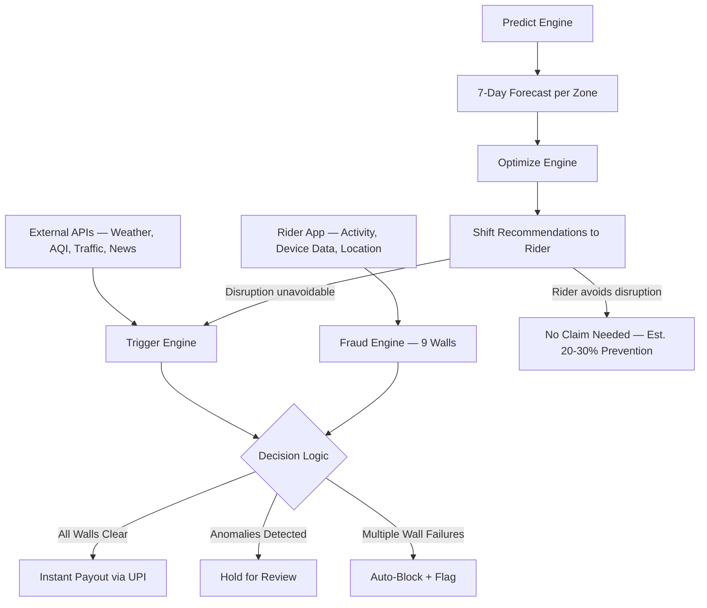

# FlowSecure — AI-Powered Income Protection for Quick-Commerce Delivery Workers

> Phase 2 submission — fully working prototype with real SQLite backend (13,000 riders · 13 cities · 8 weeks of real ledger data), live simulations, Razorpay sandbox payments, IMD-calibrated Monte Carlo actuarial projections, and a 9-wall real-time fraud detection system.

---

## ⚡ Judge Quick-Start (2 minutes)

### Option A — Shell scripts (recommended)

```bash
# 1. Clone — git-lfs pulls the seeded DB (160MB) automatically
#    Need git-lfs? → https://git-lfs.github.com  (one-time install)
git clone https://github.com/RahulPothapragada/devtrails-parametric-insurance.git
cd devtrails-parametric-insurance
git lfs pull          # downloads flowsecure.db (~30s)

# 2. One-time install (Python venv + npm packages)
./setup.sh

# 3. Start both servers (Ctrl+C stops both)
./start.sh
# Frontend → http://localhost:5173
# Backend  → http://localhost:8000
# API docs → http://localhost:8000/docs
```

### Option B — Docker (no Python/Node needed)

```bash
git clone https://github.com/RahulPothapragada/devtrails-parametric-insurance.git
cd devtrails-parametric-insurance && git lfs pull
docker-compose up --build
# Frontend → http://localhost:5173
# Backend  → http://localhost:8000
```

### Option C — Manual (if git-lfs unavailable)

```bash
git clone https://github.com/RahulPothapragada/devtrails-parametric-insurance.git
cd devtrails-parametric-insurance/backend
python -m venv venv && source venv/bin/activate
pip install -r requirements.txt
python -m app.mock_data.seed_db   # generates flowsecure.db (~30 seconds)
uvicorn app.main:app --reload --port 8000

# In a second terminal:
cd ../frontend && npm install && npm run dev
```

> **Zero configuration needed.** `.env` is committed with working SQLite URL + Razorpay test keys. No Postgres, no Redis, no external services required.

---

## 🗂️ What's Built

### Frontend Pages
| Page | Route | What it shows |
|------|-------|---------------|
| Landing | `/` | Product overview, hero demo |
| Rider Dashboard | `/rider` | Weekly forecast, AI shift optimizer, buy cover via Razorpay |
| Simulation | `/simulate` | Inject live weather/AQI/traffic triggers, watch auto-payouts fire |
| Fraud Graph | `/graph` | Geospatial map of 400+ riders per city, real-time anomaly detection |
| 9-Wall Defense | `/fraud` | Live sensor feed — 20% anomaly rate, 9 syndicate rings, ₹1.24L blocked |
| Admin Dashboard | `/admin` | Platform BCR, 13-city health table, real DB premiums vs payouts |
| Data Timeline | `/data` | 1-year simulated history + 8 real DB weeks + live tick + 12-week Monte Carlo |
| Actuarial | `/actuarial` | Per-city loss ratios, sustainability ratings, pricing model |
| Payouts | `/payouts` | Parametric claim history and UPI payout trigger |
| Story Mode | `/story` | Guided walkthrough of a disruption event end-to-end |

### Backend API Routes
| Route prefix | What it handles |
|---|---|
| `/api/auth` | Rider JWT login/register |
| `/api/riders` | Rider profile, dashboard, AI optimize |
| `/api/policies` | Weekly cover purchase, active policy lookup |
| `/api/claims` | Parametric trigger → auto-claim → auto-approve |
| `/api/payouts` | Razorpay payout initiation + confirmation |
| `/api/payments` | Razorpay order creation + webhook |
| `/api/triggers` | Weather/AQI/traffic trigger injection (simulation) |
| `/api/pricing` | Dynamic premium calculation by city/zone/tier |
| `/api/underwriting` | BCR-based suspension rules |
| `/api/fraud` | Fraud score, anomaly flags |
| `/api/admin` | Platform stats, actuarial, weekly ledger, maps, fraud summary |
| `/api/data` | Data Timeline — simulated history + real DB + Monte Carlo projection |

### Database (SQLite — 160MB seeded)
| Table | Records | Notes |
|-------|---------|-------|
| riders | 13,000 | 13 cities, activity tiers, fraud scores, device fingerprints |
| zones | ~130 | Per-city delivery zones with flood/heat risk scores |
| cities | 13 | Mumbai, Delhi, Bangalore, Chennai, Kolkata, Pune, Hyderabad, Ahmedabad, Jaipur, Lucknow, Indore, Patna, Bhopal |
| policies | 13,000 | Weekly cover, premium amounts |
| claims | ~11,000 | Auto-approved parametric claims |
| weekly_ledgers | 104 | 8 weeks × 13 cities — real premium/payout/BCR data |
| trigger_readings | ~500 | Simulated weather/AQI/traffic events |

---

---

> This README is intentionally detailed because the Phase 1 submission requires a full explanation of the product logic, pricing model, adversarial defense architecture, and proposed implementation plan — all within this single document.

---

## Table of Contents

- [Project Overview](#project-overview)
- [Current Project Status](#current-project-status)
- [Problem Statement](#problem-statement)
- [Target User](#target-user)
- [Solution Overview — Predict, Optimize, Protect](#solution-overview--predict-optimize-protect)
- [The Mathematical Edge](#the-mathematical-edge)
- [Pricing Model](#pricing-model)
- [Business Viability](#business-viability)
- [Layered Adversarial Defense — Fraud Detection](#layered-adversarial-defense--fraud-detection)
- [Adversarial Defense — Anti-Spoofing Scenario](#adversarial-defense--anti-spoofing-scenario)
- [System Architecture](#system-architecture)
- [Proposed Technical Architecture](#proposed-technical-architecture)
- [Compliance & Platform Role](#compliance--platform-role)
- [Theoretical Limitations](#theoretical-limitations)
- [Demo Workflow](#demo-workflow)
- [Repository Structure](#repository-structure)
- [Development Roadmap](#development-roadmap)
- [Team](#team)

---

## Project Overview

FlowSecure is a technical blueprint and mathematical model for an AI-enabled parametric income protection platform for India's quick-commerce delivery workforce, starting with Zepto riders across major Indian cities. This repository contains the actuarial pricing logic, 9-wall adversarial defense architecture, and full system design — built for PAN India deployment with city-specific trigger calibration.

When external disruptions like heavy rain, poor air quality, traffic gridlock, or bandhs prevent riders from earning, FlowSecure automatically compensates their lost income — no forms, no calls, no waiting.

But unlike traditional insurance, FlowSecure does not just pay you after you lose money. It actively helps you avoid losing it in the first place.

**The platform has three layers:**

1. **Predict** — The AI forecasts disruptions for the coming week and shows riders which days and hours are risky.
2. **Optimize** — The AI recommends when to work and when to avoid, so riders can shift their hours around disruptions and keep earning.
3. **Protect** — When a disruption is unavoidable (city-wide flood, bandh, severe AQI), parametric insurance kicks in automatically and pays the rider within minutes.

**What makes this different:** Most teams will build layer 3 alone. We build all three. The result: riders earn more on good days and lose less on bad days. The insurance becomes a safety net, not the entire product.

---

## Current Project Status

| Component | Status | Description |
|-----------|--------|-------------|
| Mathematical Model | ✅ Live | Dynamic premium by city/zone/tier, IMD-calibrated loss-ratio framework, BCR suspension at 85% |
| Fraud Detection | ✅ Live | 9-wall adversarial defense — 20% anomaly rate on 13,000 riders, 9 device-sharing syndicates detected, ₹1.24L blocked |
| Actuarial Projections | ✅ Live | Monte Carlo (500 paths × 12 weeks), P10/P50/P90 confidence bands, seasonal multipliers per IMD calendar |
| Data Timeline | ✅ Live | 1-year simulated history + 8 real DB weeks + live 15s tick + 12-week forward projection |
| Geospatial Fraud Map | ✅ Live | 400-rider network graph per city, attack/spoofing node classification, syndicate ring links |
| Parametric Claims | ✅ Live | Trigger injection → auto-detect → auto-approve → UPI payout via Razorpay |
| Rider Dashboard | ✅ Live | Weekly disruption forecast, AI shift optimizer, weekly cover purchase |
| PAN India Coverage | ✅ Live | 13 cities, 3 tiers, 8 weeks of real ledger data, city-specific BCR and risk scores |
| Backend API | ✅ Live | 12 route modules, FastAPI + SQLite (aiosqlite), fully async, 40+ endpoints |
| Frontend | ✅ Live | React + TypeScript + Recharts + Leaflet, 10 pages, dark theme |
| Zero-Config Setup | ✅ Live | `.env` committed, SQLite default, `./setup.sh` + `./start.sh` or `docker-compose up` |

---

## Problem Statement

**What this section covers:** Why gig delivery workers need income protection, and why no existing product addresses this.

India has over 7.7 million gig workers (NITI Aayog, 2022). Platform-based delivery riders for Zepto, Swiggy, Zomato, and Blinkit earn Rs.15,000-25,000 per month. They have no salary, no leave, no employer-provided safety net.

When it rains heavily, when AQI spikes, when a bandh is called — they simply earn nothing that day. Nobody compensates them. They absorb the full loss.

Using publicly available IMD, CPCB, and TomTom data across Indian cities, we estimate that a typical delivery rider loses approximately **10-15% of their annual income** to external disruptions they cannot control. Based on our scenario model, that translates to roughly Rs.25,000-35,000 per year lost to weather, pollution, traffic, and social unrest — and the specific disruption mix varies by city. Mumbai riders lose income to monsoon flooding and waterlogging. Delhi riders face extreme AQI events (40+ "severe" days in winter) and heat waves (45°C+). Bangalore riders deal with sudden urban flooding and traffic gridlock. These are modeled estimates based on disruption frequency data, not verified rider-level earnings data.

FlowSecure fills a critical gap in the Indian gig economy where traditional indemnity insurance fails to address high-frequency, low-severity income disruptions that gig workers face daily. The platform is designed for PAN India deployment, with city-specific trigger thresholds and zone-tier pricing calibrated to local conditions.

---

## Target User

**What this section covers:** Why we chose Zepto riders over Swiggy/Zomato, and what the rider actually cares about.

We chose **Zepto (quick-commerce/grocery delivery)** over food delivery platforms like Swiggy or Zomato for specific reasons:

**How a Zepto rider works:**
- Assigned to a specific dark store (small warehouse), not free-roaming
- Delivers within a 1-3 km radius from the dark store
- Works fixed shifts of 4-6 hours (unlike Swiggy/Zomato's flexible model)
- Completes 15-25 deliveries per shift at Rs.15-25 per order
- Earns Rs.500-1,000 per day, approximately Rs.4,500 per week
- The 10-minute delivery promise means any disruption breaks the model completely

**Why Zepto, not Swiggy:**

| Factor | Zepto | Swiggy |
|--------|-------|--------|
| Disruption impact | Binary — deliveries halt completely when it rains | Gradual — orders reduce but don't fully stop |
| Surge pricing | No surge — disruption means pure income loss | Surge during rain complicates the loss calculation |
| Zone size | 1-3 km from dark store — very precise | 5-8 km radius — harder to verify |
| Shift structure | Fixed shifts — easy to verify who was working | Flexible hours — harder to verify |
| Trigger clarity | Platform pauses dispatch — verifiable data point | Grey area between reduced and stopped |

**Why this matters:** When Zepto's dark store pauses dispatch due to flooding, every rider assigned to that store is affected equally. This gives us clean, verifiable data. There is no ambiguity about whether the rider "could have worked" — the platform itself stopped sending orders.

**What the rider actually wants:**

We spent time understanding what a street-smart delivery worker cares about. They do not want to learn about "parametric triggers" or "coverage percentages." They want three things:

1. **Stable weekly income** — "I need to make Rs.4,000+ every week no matter what"
2. **No hassle** — "If something goes wrong, just pay me. Don't make me fill forms"
3. **Fair price** — "I'll pay a little if it actually helps, but don't waste my money"

Our entire product is designed around these three needs.

---

## Solution Overview — Predict, Optimize, Protect

**What this section covers:** Exactly what each AI layer does, what data it uses, and how we build it. We are specific because "AI-powered" means nothing if you cannot explain it.

### Layer 1: Predict — What will happen this week?

**What it does:** Every Sunday, the system generates a 7-day disruption forecast for each zone across all active cities. It combines weather forecasts, AQI trends, traffic patterns, and event calendars to estimate how each day will affect rider earnings in that specific city and zone.

**What data it uses:**
- 7-day weather forecast from OpenWeatherMap API (rainfall, temperature, humidity)
- Current and trending AQI from CPCB/WAQI API
- Traffic congestion data from TomTom Traffic API
- News feed scanning for upcoming bandhs/strikes via NewsAPI

**What the rider sees:**

The rider does not see weather data. They see earnings impact:

- "Monday: Normal day. Work your regular shift."
- "Wednesday 2-8 PM: Heavy rain expected. Your zone will likely be paused."
- "Thursday: Storm continuing. Stay home — your insurance covers today."
- "Friday: Clearing up. High demand expected — good earning day."

**How we build it:** A Python function that pulls forecast data from APIs, maps each trigger to an earnings impact percentage based on historical patterns, and generates a per-day, per-block (morning/afternoon/evening) earnings estimate. This is not a machine learning model — it is a rule-based system using real weather thresholds from IMD data. We are honest about this.

### Layer 2: Optimize — How should I work this week?

**What it does:** Takes the prediction and generates specific shift recommendations that help the rider avoid income loss without needing insurance.

**The logic:**
- If rain is expected Wednesday afternoon → recommend morning shift instead
- If disruption is city-wide and unavoidable → recommend rest, insurance covers it
- If disruption is moderate → recommend extending hours on safe days to compensate

**Example:**

A rider normally works 4 PM to midnight. The AI sees heavy rain forecast for Wednesday 2-8 PM.

Without AI guidance: Rider goes to work at 4 PM, rain hits, dark store pauses, rider earns Rs.200 for the day instead of Rs.820.

With AI guidance: Rider shifts to 7 AM - 1 PM on Wednesday (before rain). Earns Rs.620. Saves Rs.420 compared to their normal schedule — without any insurance claim needed.

**Why this matters for the business:** Based on our scenario modeling, if riders follow optimization recommendations, an estimated 20-30% of potential insurance claims could be prevented. The rider earns more, and the company pays out less. Both sides win.

**Optimization constraints (so recommendations are realistic, not just theoretical):**

- **Fatigue buffer:** The system never recommends a shift that starts within 8 hours of the previous shift ending.
- **Minimum earnings threshold:** If the "safe" shift earns less than the risky shift + expected insurance payout, the recommendation is skipped.
- **Recommendation, not mandate:** The rider always sees their options and chooses. The AI suggests, it does not force.

**The constraint logic:** `Earnings_Safe > (Earnings_Risky × (1 - Risk%)) + Expected_Payout`. If the safe shift does not beat the insured risky shift, the system recommends resting and letting the insurance cover it.

**How we build it:** A Python function that takes the prediction output, compares it against the rider's usual shift, and generates an alternative schedule that maximizes earnings in safe time blocks. Rule-based optimization, not deep learning.

### Layer 3: Protect — Parametric insurance safety net

**What it does:** When a disruption is unavoidable — city-wide flooding, full-day bandh, severe AQI — the system automatically detects the event, verifies it through multiple sources, and pays the rider's lost income directly to their UPI account. No claim form. No phone call. No approval process.

**What makes it parametric:**

Traditional insurance: Rider files a claim → company investigates → weeks later, maybe gets paid.

Parametric insurance: A measurable threshold is crossed (rainfall > 64.5mm/day, AQI > 200) → system detects it automatically → payout happens within minutes. The trigger is the data, not the rider's word.

**Our 6 triggers and their thresholds (based on real data):**

| Trigger | Threshold | Source | Real Basis |
|---------|-----------|--------|------------|
| Rainfall | >64.5mm/day (IMD "heavy" category) | OpenWeatherMap + IMD | BMC drains handle only 25mm/hr; above this = waterlogging |
| Extreme Heat | >40°C | OpenWeatherMap | IMD heat wave classification; 25+ days/year in Delhi, frequent in Nagpur, Hyderabad |
| Cold/Fog | Visibility <500m | OpenWeatherMap | IMD fog classification |
| Air Quality | AQI >200 ("Poor" category) | CPCB/WAQI API | CPCB's own "poor" threshold; 17 such days in Dec 2022 alone |
| Traffic | Average speed <10 km/hr for 2+ hours | TomTom Traffic API | Mumbai at 16.9 km/hr, Bangalore at 17.4 km/hr, Delhi at 18.2 km/hr (TomTom 2025) |
| Social Disruption | Official bandh/curfew declared | NewsAPI + NLP keyword matching | 3-5 bandh calls per year nationally; frequency varies by state |

**How payout is calculated:**

```
Payout = Zone Impact Score × Hours Lost × Zone Average Hourly Rate × 0.60

Where:
  Zone Impact Score = What percentage of riders in this zone actually stopped working
                      (from our own data — if 85% stopped, score = 0.85)
  Hours Lost        = Duration of the trigger event
  Zone Avg Rate     = Average hourly earnings for this zone tier
  0.60              = Coverage cap (we cover 60% of verified loss)
```

We pay based on **verified zone-wide impact**, not individual claims. This means even if someone games the system, the payout is based on what actually happened in the zone, not what they say happened.

---

## The Mathematical Edge

**What this section covers:** How the pricing model addresses adverse selection and why the Optimize layer is the economic moat.

Our model is designed to address the **adverse selection problem** — the risk that riders only subscribe when they know they will claim, and drop out during calm periods.

We address this through three mechanisms:

1. **Year-round triggers:** Not just monsoon rain. Heat, AQI, traffic, and social disruptions create risk in every season, making the subscription valuable 12 months a year.

2. **Optimize-layer incentive alignment:** The formula `Earnings_Safe > (Earnings_Risky × (1 - Risk%)) + Expected_Payout` ensures riders are incentivized to avoid disruptions rather than "fish" for insurance payouts. The system rewards active participation, not passive claiming.

3. **Target loss ratio of ~61%:** Modeled on historical disruption data across Indian cities (IMD 2018-2024, CPCB, TomTom). This target sits within the insurance industry standard of 60-75%, leaving room for operating costs and margin while still providing meaningful coverage to riders.

**Why the Optimize layer is the economic moat:** Traditional insurance companies hate payouts. FlowSecure reduces the need for payouts by helping riders avoid the disruption entirely — our scenario model estimates 20-30% of potential claims could be prevented through AI-guided shift optimization. This aligns the interests of the rider, the platform, and the insurer.

---

## Pricing Model

**What this section covers:** Zone-tier structure, weekly premium calculations, affordability, and how prices adjust weekly. All figures are scenario-modeled estimates based on publicly available data.

### Structure: City × Zone Tier × Season

The premium is the same for every rider in the same city, zone tier, and week. It changes based on three things: which city, which risk zone, and what time of year. Each city has its own trigger calibration based on local conditions.

**Zone Tiers (PAN India — city-specific examples):**

**Mumbai:**

| Tier | Zones | Risk Profile | Why |
|------|-------|-------------|-----|
| Tier 1 (High) | Andheri West, Dadar, Kurla, Sion, Hindmata | Flood-prone, poor drainage | BMC identifies 84 chronic waterlogging hotspots, concentrated in these areas |
| Tier 2 (Medium) | Bandra, Goregaon, Malad, Borivali | Average infrastructure | Some flooding but better drainage than Tier 1 |
| Tier 3 (Low) | Powai, BKC, Thane, Navi Mumbai | Elevated terrain, newer drainage | Rarely floods, good road infrastructure |

**Delhi-NCR:**

| Tier | Zones | Risk Profile | Why |
|------|-------|-------------|-----|
| Tier 1 (High) | Anand Vihar, Jahangirpuri, Mundka, Bawana | Severe AQI + flooding + heat | AQI regularly exceeds 400+ in winter; waterlogging during monsoon |
| Tier 2 (Medium) | Dwarka, Rohini, Laxmi Nagar, Saket | Moderate AQI, some heat exposure | AQI 200-300 range; heat waves in May-June |
| Tier 3 (Low) | Lutyens Delhi, Greater Noida, Gurugram (new sectors) | Better infrastructure, lower AQI | Newer roads, better drainage, relatively lower pollution |

**Bangalore:**

| Tier | Zones | Risk Profile | Why |
|------|-------|-------------|-----|
| Tier 1 (High) | Silk Board, Bellandur, Marathahalli, KR Puram | Extreme traffic + urban flooding | Silk Board junction among worst bottlenecks in India; Bellandur lake overflow risk |
| Tier 2 (Medium) | Koramangala, HSR Layout, Whitefield | Moderate traffic, some flooding | Traffic congestion during peaks; occasional waterlogging |
| Tier 3 (Low) | Indiranagar, MG Road, Jayanagar | Better drainage, manageable traffic | Older planned areas with better infrastructure |

**How this scales:** Each city gets its own zone-tier map calibrated to local data. The trigger thresholds remain the same nationally (rainfall >64.5mm, AQI >200, etc.), but the *frequency* and *seasonal pattern* of these triggers varies by city — which is why premiums differ.

**Proposed Weekly Premiums — Mumbai (scenario-modeled):**

| Season | Tier 1 | Tier 2 | Tier 3 |
|--------|--------|--------|--------|
| Jun-Sep (Monsoon) | Rs.86/wk | Rs.70/wk | Rs.52/wk |
| Mar-May (Heat + Pre-monsoon) | Rs.72/wk | Rs.58/wk | Rs.43/wk |
| Oct-Nov (Cyclone + AQI) | Rs.68/wk | Rs.55/wk | Rs.42/wk |
| Dec-Feb (AQI + Fog) | Rs.62/wk | Rs.50/wk | Rs.38/wk |
| **Annual Average** | **Rs.75/wk** | **Rs.60/wk** | **Rs.45/wk** |

**Proposed Weekly Premiums — Delhi-NCR (scenario-modeled):**

| Season | Tier 1 | Tier 2 | Tier 3 |
|--------|--------|--------|--------|
| Nov-Jan (Severe AQI + Fog) | Rs.92/wk | Rs.74/wk | Rs.55/wk |
| Apr-Jun (Heat wave) | Rs.82/wk | Rs.66/wk | Rs.48/wk |
| Jul-Sep (Monsoon flooding) | Rs.78/wk | Rs.62/wk | Rs.46/wk |
| Feb-Mar, Oct (Moderate) | Rs.58/wk | Rs.46/wk | Rs.35/wk |
| **Annual Average** | **Rs.78/wk** | **Rs.62/wk** | **Rs.46/wk** |

**Proposed Weekly Premiums — Bangalore (scenario-modeled):**

| Season | Tier 1 | Tier 2 | Tier 3 |
|--------|--------|--------|--------|
| Sep-Nov (Urban flooding) | Rs.80/wk | Rs.64/wk | Rs.48/wk |
| Jun-Aug (Heavy rain) | Rs.74/wk | Rs.60/wk | Rs.44/wk |
| Mar-May (Pre-monsoon + traffic) | Rs.65/wk | Rs.52/wk | Rs.40/wk |
| Dec-Feb (Moderate) | Rs.55/wk | Rs.44/wk | Rs.34/wk |
| **Annual Average** | **Rs.68/wk** | **Rs.55/wk** | **Rs.41/wk** |

**Why premiums differ by city:** Delhi's peak risk is winter (AQI/fog), not monsoon. Mumbai's peak is monsoon (flooding). Bangalore's peak is September-November (urban flooding + traffic). The same 6 triggers apply everywhere, but their frequency and severity are city-specific.

**Affordability check:**

| Tier | Annual Premium | As % of Annual Income | Cost per Day |
|------|---------------|----------------------|-------------|
| Tier 1 | Rs.3,900 | 1.67% | Rs.11 (less than a vada pav) |
| Tier 2 | Rs.3,120 | 1.33% | Rs.9 |
| Tier 3 | Rs.2,340 | 1.00% | Rs.6.4 |

**Estimated rider return (modeled average year):**

| Tier | Premium Paid | Claims Received | Return |
|------|-------------|----------------|--------|
| Tier 1 | Rs.3,900 | Rs.2,400 | 62% |
| Tier 2 | Rs.3,120 | Rs.1,900 | 61% |
| Tier 3 | Rs.2,340 | Rs.1,400 | 60% |

In a bad monsoon year (like 2024 with 300mm in 6 hours on July 8), Tier 1 riders could receive an estimated Rs.4,200+ in claims — potentially more than they paid in premium. These projections are scenario-based and would need validation with real rider data.

**How the AI recalculates weekly:**

Every Sunday, the pricing engine runs:
1. Pulls next week's weather forecast
2. Checks current AQI trend
3. Scans news for upcoming events/holidays
4. Looks at last 4 weeks of actual claims per zone
5. Adjusts premium up or down (capped at ±15% from seasonal base)
6. Cap: Premium never exceeds 2% of average zone earnings

The rider always sees next week's price before it is charged.

---

## Business Viability

**What this section covers:** Projected unit economics — per-city model (1,000 riders) and PAN India scale projection.

> **Prototype assumption:** All financial figures below are modeled estimates based on publicly available disruption data (IMD, CPCB, TomTom) and reported gig worker earnings (Zepto job postings, Inc42, Fairwork India). These are prototype calculations, not verified actuals. Actual unit economics would require real rider data and a production pilot.

**Per-City Model (1,000 riders — Mumbai example):**

| Segment | Riders | Avg Weekly Premium | Annual Revenue |
|---------|--------|-------------------|---------------|
| Tier 1 (High Risk) | 350 | Rs.75 | Rs.13,65,000 |
| Tier 2 (Medium Risk) | 400 | Rs.60 | Rs.12,48,000 |
| Tier 3 (Low Risk) | 250 | Rs.45 | Rs.5,85,000 |
| **Total** | **1,000** | | **Rs.31,98,000** |

**Estimated Payouts (after Optimize layer prevention + fraud detection):**

| Segment | Riders | Annual Claims | Total |
|---------|--------|--------------|-------|
| Tier 1 | 350 | Rs.2,400/rider | Rs.8,40,000 |
| Tier 2 | 400 | Rs.1,900/rider | Rs.7,60,000 |
| Tier 3 | 250 | Rs.1,400/rider | Rs.3,50,000 |
| **Total** | | | **Rs.19,50,000** |

**Projected P&L (per city, 1,000 riders):**

| Metric | Value |
|--------|-------|
| Projected Annual Revenue | Rs.31,98,000 |
| Estimated Annual Payouts | Rs.19,50,000 |
| Estimated Gross Profit | Rs.12,48,000 |
| Target Loss Ratio | ~61% |
| Estimated Operating Costs (APIs, hosting, support) | Rs.3,50,000 |
| **Estimated Net Profit** | **Rs.8,98,000** |
| **Target Net Margin** | **~28%** |

**PAN India Scale Projection (scenario-modeled):**

| City | Est. Riders (Year 1) | Avg Weekly Premium | Est. Annual Revenue |
|------|---------------------|-------------------|-------------------|
| Mumbai | 1,000 | Rs.65 | Rs.31,98,000 |
| Delhi-NCR | 1,200 | Rs.68 | Rs.42,43,200 |
| Bangalore | 800 | Rs.55 | Rs.22,88,000 |
| Hyderabad | 500 | Rs.52 | Rs.13,52,000 |
| Pune | 400 | Rs.50 | Rs.10,40,000 |
| Chennai | 400 | Rs.48 | Rs.9,98,400 |
| **Total PAN India** | **4,300** | | **Rs.1,31,19,600** |

**Why this scales:** The platform architecture is city-agnostic. Adding a new city requires only: (1) zone-tier mapping from local municipal data, (2) trigger threshold calibration from local IMD/CPCB data, (3) dark store location mapping from Zepto operations. The AI engines, fraud detection, and payout infrastructure remain the same.

The target loss ratio of ~61% is modeled on scenario assumptions and referenced disruption data (IMD, CPCB, TomTom). It sits within the insurance industry standard of 60-75%, indicating a viable prototype model. The Optimize layer (targeting 20-30% claim prevention through AI guidance) and fraud detection (estimated 10-15% payout reduction) are the key margin drivers. These figures would need validation through a production pilot.

**Data sources for all financial calculations:**

| Data Point | Source |
|-----------|--------|
| Rider earnings | Zepto job postings, Inc42, Economic Times, Fairwork India 2023-24 |
| Rainfall events | IMD regional observatories (Mumbai: 2,502mm annual; Delhi: 797mm; Bangalore: 970mm) |
| Flooding | BMC Mumbai (84 chronic hotspots); BBMP Bangalore (Bellandur, ORR flooding); Delhi MCD (Yamuna floodplain) |
| AQI | CPCB data — Delhi: 40+ "severe" days/year; Mumbai: 17 "poor" days Dec 2022; Bangalore: moderate year-round |
| Heat waves | IMD classifications — Delhi: 25+ days >40°C; Hyderabad, Nagpur: frequent heat alerts |
| Traffic | TomTom Traffic Index 2025 — Mumbai 3rd, Bangalore 5th, Delhi 8th most congested globally |
| Bandh frequency | SATP database, news reports (3-5 per year nationally, varies by state) |

---

## Layered Adversarial Defense — Fraud Detection

**What this section covers:** The 9-wall fraud detection architecture organized into two tiers — data-native walls using real platform data, and device-level walls using mock data trails for the hackathon.

### The core challenge

In a parametric system where payouts are automatic, the biggest risk is fraud — riders claiming income loss when they were not actually working, or coordinated groups gaming the system.

Our fraud detection uses **9 walls** organized into two tiers:

- **Tier A (Data-Native Walls 1-5):** Built on data we directly own — platform activity logs, claims database, external API data, and registration metadata. These walls run on every single claim in real-time.
- **Tier B (Device & Network Walls 6-9):** Built on device-level and network-level signals like WiFi fingerprinting, cell tower triangulation, device fingerprinting, and motion data. In production, these would come from the mobile app. **For the hackathon, we implement these using mock data trails** — simulated device data that lets us demonstrate the full detection logic, algorithms, and decision pipeline. The mock data is clearly labelled as simulated, but the detection algorithms are real and production-ready.

### Tier A: Data-Native Walls (Real Data)

**Wall 1: Platform Activity Verification — "Were you actually working?"**

Before approving any claim, we check the rider's activity on the Zepto platform (via our simulated API):

- When did they log in?
- How many deliveries did they complete before the disruption started?
- Were they continuously active, or did they log in moments before the trigger event?

**The rule:** A rider must have at least 2 hours of verified deliveries before the disruption event to receive a full payout. Less than 30 minutes of activity or zero deliveries means the claim is denied — the disruption did not cause their income loss because they were not earning income.

**What this catches:** Riders sitting at home, seeing rain on the forecast, logging into the app for 5 minutes, and collecting a payout.

**Wall 2: Multi-Source Trigger Consensus — "Is the event even real?"**

We never trust a single data source. Every trigger event must be confirmed by at least 3 independent sources:

- Source 1: Weather/AQI API (OpenWeatherMap, CPCB)
- Source 2: Platform data (did the dark store actually pause dispatch?)
- Source 3: Zone-wide rider behavior (what percentage of riders stopped working?)
- Source 4: Second weather/AQI source for cross-reference

If only 1 out of 4 sources confirms the event, no payouts are issued. If 3 or more agree, claims are processed.

**Wall 3: Peer Comparison — "Did other riders in your zone also stop?"**

When a rider claims they could not work, we compare them against every other rider in the same zone during the same time window.

- If 85% of riders at the same dark store stopped working → the event was real, all claims are credible.
- If only 1 out of 15 riders stopped and the other 14 continued delivering → that one rider's claim does not match zone reality.

We also use **inverse verification**: we check what riders who continued working actually earned. If they earned 80% of their normal income, the actual zone-wide loss was only 20% — and payouts are adjusted accordingly.

**Wall 4: Graph Network Analysis — "Are you part of a coordinated fraud ring?"**

Using Python's NetworkX library, we build a relationship graph connecting riders through shared attributes:

- Same phone number or email across multiple accounts
- Same UPI payout ID receiving money from multiple accounts
- Same IP address during registration
- Login timestamps within 60 seconds of each other across 5+ events
- Identical claim patterns (same events claimed, every time)

We run the Louvain community detection algorithm on this graph. It identifies densely connected clusters — groups of accounts that are suspiciously linked. Normal riders appear as isolated nodes with 0-2 connections. Fraud rings appear as dense meshes with dozens of cross-links.

**Wall 5: Temporal Pattern Analysis — "Does your long-term behavior look honest?"**

Over weeks and months, we track each rider's claiming patterns and compare them to their zone's average:

- **Claim frequency:** Zone average is 35% of events. A rider claiming on 95% of events is 4+ standard deviations above normal.
- **Login-trigger correlation:** A rider who only logs in within 15 minutes before triggers fire correlates suspiciously with payout opportunities.
- **Day-of-week consistency:** A rider who never works Tuesdays (for 8 weeks straight) but claims income loss on a Tuesday trigger did not lose income from the disruption.
- **Claim amounts:** Honest riders have varying claim amounts (Rs.120, Rs.280, Rs.190). Riders who always claim the maximum are flagged.

### Tier B: Device & Network Walls (Mock Data Trails)

These walls use device-level signals that would come from a native mobile app in production. For the hackathon, we generate realistic mock data trails to demonstrate the full detection pipeline. The algorithms are real — only the data source is simulated.

**Wall 6: WiFi BSSID Fingerprinting — "Is your device actually in this zone?"**

Every zone has a known set of WiFi access points (BSSIDs). We check whether the WiFi networks detected by the rider's device match the expected BSSID list for the claimed zone. If 4+ out of 10 match → location is consistent. If 0 match → the rider is likely elsewhere.

**Why this beats GPS:** WiFi BSSIDs require physical proximity to specific routers (50-100m). Spoofing 10 unique BSSIDs matching a specific zone is far harder than spoofing GPS.

**Mock implementation:** Python dict mapping zone IDs → expected BSSIDs. Detection logic checks set intersection and calculates a location confidence score.

**Wall 7: Cell Tower Triangulation — "Does your network connection confirm your location?"**

Each zone is mapped to 3-5 expected cell tower IDs. We verify the rider's connected tower matches the expected zone and triangulate using signal strengths from 3 towers.

**Why this helps:** A rider using GPS spoofing still connects to their actual local cell tower. Sitting at home in Thane but claiming Andheri → their tower ID betrays them.

**Mock implementation:** Lookup table of zone → tower IDs. Algorithm checks tower-zone match and flags mismatches.

**Wall 8: Device Fingerprinting — "How many accounts are using this device?"**

Each device has unique identifiers (IMEI, model, OS version, screen resolution). We hash these into a fingerprint. If 5 different rider accounts submit claims from the same device fingerprint → likely fake accounts controlled by one person.

**What it catches:** One person running multiple accounts, account selling, emulated devices (bot farms with identical fingerprints).

**Mock implementation:** Unique device hashes per rider. Fraud scenarios share hashes. Detection query: `GROUP BY device_hash HAVING COUNT(rider_id) > 1`.

**Wall 9: Motion & Activity Detection — "Were you actually moving like a delivery rider?"**

A working rider's device shows constant motion — acceleration, turns, stops at delivery addresses. A parked phone shows flatline accelerometer data. GPS spoofers show moving coordinates but zero physical motion — an impossible combination.

**Mock implementation:** Time-series motion data per rider per shift. Honest riders get realistic ride/stop/ride patterns. Fraud scenarios get flatline accelerometer + moving GPS.

### Cost of Attack — Why Each Wall Matters

| Wall | Signal | Spoof Difficulty | Why It Is Hard to Fake |
|------|--------|:----------------:|------------------------|
| Wall 1 | Platform Activity | **Extreme** | Requires real Zepto order IDs, delivery timestamps, and dark store check-ins |
| Wall 2 | Multi-Source Consensus | **Extreme** | Cannot fake OpenWeatherMap, CPCB, and dark store dispatch simultaneously |
| Wall 3 | Peer Comparison | **Extreme** | Would need to fake activity for 85% of all riders in the zone |
| Wall 4 | Graph Analysis | **High** | Requires unique IPs, unique UPIs, unique emails, and random login times across all fake accounts |
| Wall 5 | Temporal Patterns | **High** | Requires months of consistent, realistic claiming behavior |
| Wall 6 | WiFi BSSID | **High** | Requires physical proximity to specific routers in the claimed zone |
| Wall 7 | Cell Tower | **High** | Cannot spoof which tower your phone connects to without hardware |
| Wall 8 | Device Fingerprint | **Medium** | Requires a unique physical device per fake account |
| Wall 9 | Motion/Accelerometer | **Medium** | Spoofing realistic delivery-pattern motion is significantly harder than spoofing GPS |

**Design goal:** To successfully defraud FlowSecure, an attacker would need to beat at least 6 of these walls simultaneously. The cost and effort required exceeds the potential payout — a defense-in-depth architecture designed to make the cost of fraud exceed the reward.

### How Mock Trails Work in Our Demo

We generate two datasets for demonstration:

1. **Honest rider dataset (80%):** Realistic device data — WiFi BSSIDs match their zone, cell tower matches, unique device fingerprint, normal motion patterns. All 9 walls pass → instant payout.

2. **Fraud scenario dataset (20%):** Deliberately planted inconsistencies:
   - Rider A: GPS says Andheri, WiFi BSSIDs match Thane → Wall 6 catches
   - Rider B: GPS moving across Mumbai, accelerometer shows zero motion → Wall 9 catches
   - Riders C, D, E: Three accounts, same device fingerprint → Wall 8 catches
   - Rider F: Cell tower connected to Navi Mumbai, claims in Dadar → Wall 7 catches

**Fraud Confidence Scorecard** (shown in admin dashboard):

| Rider ID | Wall Failures | Confidence Score | Action |
|----------|--------------|:----------------:|--------|
| R-047 | None | 0/100 | **Instant Payout** ✅ |
| R-205 | Wall 1 (minor — logged in 25 min before event) | 15/100 | **Flag for Review** ⚠️ |
| R-102 | Walls 1, 6, 7, 9 | 88/100 | **Auto-Block** 🚫 |
| R-089 | Walls 4, 8 (shared device + same IP cluster) | 92/100 | **Auto-Block + Ring Alert** 🚫 |

**Key principle:** The system does not treat fraud as binary. A single anomaly is logged, not punished. Multiple converging signals across different walls trigger escalation.

### Protecting Honest Riders

- **No single wall triggers denial.** A rider must fail 3+ walls before any action is taken.
- **Bulk-approve first.** When a trigger fires, 80% of riders with clear data are approved instantly (under 30 seconds). Only anomalies face deeper checks.
- **Hidden fraud score.** Riders never see their internal trust score (0-100). Clean riders get instant payouts. Suspicious riders experience processing delays.
- **Recovery path.** A falsely flagged rider recovers their score within 4 clean weeks. Wrongly denied claims are reversed with clear reasons.
- **Transparent denial.** If denied, the rider sees a specific reason and a clear path to appeal.
- **Tier B walls are supplementary.** Walls 6-9 add to the fraud score but never single-handedly deny a claim.

---

## Adversarial Defense — Anti-Spoofing Scenario

**What this section covers:** How the 9-wall system responds to a coordinated 500-rider GPS spoofing attack in real-time. This is our response to the Market Crash challenge.

### Scenario: 500 riders with fake GPS drain the payout pool

GPS spoofing apps are free and widely available. Any fraud defense that relies on GPS alone is already broken. Our defense does not depend on GPS verification at all.

**How our system handles the 500-rider attack:**

**T+0 sec:** Rain trigger fires in Andheri West. 500 claims received.

**T+2 sec:** Wall 2 checks — is the event real? Weather API confirms heavy rain. Dark store confirms dispatch paused. 87% of zone riders stopped working. Event is confirmed genuine.

**T+3 sec:** Wall 1 checks platform activity for all 500 claimants:
- 180 riders had 3+ hours of completed deliveries before the event → **auto-approved instantly**
- 47 riders had 1-2 hours of activity → **approved with proportional payout**
- 273 riders had zero deliveries or logged in within minutes of the event → **held for deeper checks**

**T+10 sec:** Wall 4 runs graph analysis on the 273 held riders:
- 48 accounts registered from the same IP address
- 92 accounts login within the same 3-minute window across 10+ past events
- 37 accounts share the same UPI payout ID
- Louvain algorithm detects 4 distinct fraud clusters
- **All 261 ring members frozen**

**T+12 sec:** Tier B walls run on the 273 held riders for additional signals:
- Wall 6: 189 riders' WiFi BSSIDs do not match Andheri West zone
- Wall 7: 165 riders connected to cell towers in completely different areas (Thane, Navi Mumbai)
- Wall 8: 23 accounts share just 4 unique device fingerprints
- Wall 9: 201 riders show zero accelerometer motion despite GPS coordinates "moving"

**T+15 sec:** Wall 5 checks remaining 12 edge cases (new riders, ambiguous data):
- Held for 24-hour manual review with benefit of doubt

**Result:**
- 227 genuine riders: Paid (180 instantly, 47 within minutes)
- 261 fraud ring members: Blocked (caught by multiple walls, not just one)
- 12 edge cases: Reviewed within 24 hours
- Estimated money lost to fraud: Rs.0 (in this modeled scenario)
- Honest riders denied: 0 (by design — benefit of doubt for edge cases)
- Estimated time to neutralize: Under 30 seconds

**Why GPS spoofing is irrelevant to our system:**

Our defense works in two layers. Tier A walls do not verify WHERE the rider was — they verify WHETHER they were working. A GPS spoofing app cannot generate 6 hours of completed Zepto deliveries with real order IDs. But even if a sophisticated attacker could fake platform activity, Tier B walls catch what GPS spoofing cannot hide: your WiFi environment does not match the claimed zone, your cell tower is in a different city, your device fingerprint matches 4 other "separate" accounts, and your accelerometer shows you never moved despite GPS showing a full delivery route. Each layer independently blocks fraud — together, they create a defense-in-depth architecture where the cost of a successful attack exceeds the potential payout.

**Design philosophy:** The best anti-fraud system does not just catch fraud. It makes fraud harder than honest work. If gaming our system requires actually showing up to the dark store and completing real deliveries for 2+ hours first, at that point it is easier to just be an honest rider.

---

## System Architecture

**What this section covers:** How data flows through the platform from external APIs to rider payouts.



**Data flow summary:**
1. Every Sunday, the Predict engine pulls forecast data and generates a 7-day risk map per zone
2. The Optimize engine converts this into shift recommendations that help riders avoid income loss
3. When a disruption is unavoidable, the Trigger engine detects threshold breaches from 3+ sources
4. The Fraud engine runs all 9 walls (Tier A in real-time, Tier B for flagged cases)
5. Clean riders get instant UPI payouts. Suspicious cases are held for review.

---

## Proposed Technical Architecture

**What this section covers:** Each technology was chosen for a specific reason tied to the problem — not as a generic stack.

| Component | Technology | Why This Fits the Problem |
|-----------|-----------|--------------------------|
| **Backend** | Python (FastAPI) | High-speed asynchronous processing of weather/traffic trigger events; AI/ML and backend in same language; auto-generates API docs for rapid development |
| **Frontend** | React + Tailwind CSS | Component-based, mobile-first UI for rider and admin dashboards |
| **Database** | PostgreSQL | Relational, ACID compliant; handles complex zone-tier queries and geospatial rider-zone mapping |
| **Cache** | Redis | Sub-millisecond reads for active weather alerts, rider status, and live trigger states |
| **AI/ML** | scikit-learn, Pandas | Disruption risk scoring, zone segmentation, and predictive modeling on engineered operational features |
| **Graph Analysis** | NetworkX (Python) | Fraud ring detection via Louvain community detection — identifies densely connected rider clusters |
| **Weather API** | OpenWeatherMap (free tier) | Rainfall, temperature, visibility — 1000 calls/day free |
| **AQI API** | WAQI.info / aqicn.org (free) | Real-time AQI for Indian cities |
| **Traffic API** | TomTom Traffic (free tier) | Congestion and flow speed data for trigger verification |
| **News API** | NewsAPI.org (free tier) | Bandh/strike detection via keyword matching |
| **Platform API** | Mock API (self-built) | Simulates Zepto's rider activity and dark store dispatch data |
| **Payments** | Razorpay Test Mode | Simulates UPI payouts — Indian, free, realistic for demos |
| **Deployment** | Vercel (frontend) + Railway (backend) | Free tiers, sufficient for hackathon prototype |
| **Maps** | React Leaflet + OpenStreetMap | Zone visualization and risk heat maps — free and open-source |
| **Charts** | Recharts | Dashboard analytics, loss ratio charts, and fraud scorecard visualization |

---

## Compliance & Platform Role

**What this section covers:** Regulatory positioning, privacy approach, and catastrophic event safeguards.

### What FlowSecure is (and is not)

FlowSecure is a **parametric protection technology platform** — not an insurance company. In a production deployment, FlowSecure would operate as a technology and decision-support layer that partners with a licensed insurer (such as HDFC ERGO, Digit, or Acko) to underwrite the actual parametric contracts.

For the hackathon, we simulate the full end-to-end flow including payouts (via Razorpay test mode), but we acknowledge that a real rollout would require:

- **IRDAI Regulatory Sandbox application** — IRDAI has an active sandbox framework for insurtech innovation. FlowSecure's parametric model is a strong candidate for this pathway.
- **Licensed insurer partnership** — FlowSecure provides the AI, trigger detection, fraud prevention, and rider interface. A licensed partner handles underwriting, reserves, and regulatory compliance.

### Privacy and data handling

Tier B device signals (WiFi BSSIDs, cell tower data, motion data) raise legitimate privacy questions. Our approach, designed with India's Digital Personal Data Protection Act (DPDP, 2023) principles in mind:

- **On-duty only collection** — Device signals are only collected during active shifts. Off-duty data is never captured.
- **Hash and discard** — Raw device identifiers (IMEI, BSSIDs) are hashed immediately. We store fingerprints, not identifiers.
- **Purpose limitation** — Device data is used exclusively for fraud detection, never for marketing, profiling, or resale.
- **Explicit consent** — Riders are informed during onboarding exactly what data is collected and why.
- **Minimum retention** — Fraud scores are retained for 6 months. Raw signal data is purged after 30 days.

**Production note:** In a production system, this would require formal DPDP compliance review. For the hackathon, these principles guide our architecture design.

### Catastrophic event protection

What happens if a city-wide event (Mumbai monsoon deluge, Delhi AQI emergency, Bangalore urban flooding) triggers payouts for thousands of riders simultaneously?

- **Stop-loss cap** — Total payouts in any single week are capped at 3× the weekly premium pool. Beyond this, payouts are prorated.
- **Catastrophe reserve** — 5% of all premiums collected are set aside in a reserve fund for city-wide events.
- **Reinsurance pathway** — In production, catastrophic risk would be transferred to a reinsurer. The platform retains normal-frequency risk and passes tail risk upstream.

---

## Theoretical Limitations

**What this section covers:** Known constraints we have identified and how we account for them. No system is perfect.

| Limitation | Impact | How We Account for It |
|-----------|--------|----------------------|
| **Data latency** | Weather/AQI APIs can lag 5-15 minutes | Trigger engine uses a buffer — threshold must sustain 30+ minutes before firing |
| **GPS urban canyons** | GPS drift of 50-200m in dense areas like Lower Parel (Mumbai), Connaught Place (Delhi) | Fraud engine uses confidence scores, not binary pass/fail. Tier B walls (WiFi, cell tower) are unaffected by GPS drift |
| **Optimize adoption** | Not all riders will follow shift recommendations | Financial model assumes only 40-50% adoption rate, not 100% |
| **Mock vs production data** | Tier B walls use simulated device signals | Algorithms are production-ready, but real-world accuracy needs validation with actual device data |
| **City onboarding effort** | Each new city requires zone-tier mapping, trigger calibration, and local data sourcing | The architecture is city-agnostic; only the configuration layer changes per city. Core AI engines and fraud detection remain the same |

---

## Demo Workflow

**What this section covers:** Step-by-step walkthrough of what the final demo will show — covering the clean path, fraud detection, and edge cases.

1. **Introduce Ravi** — a Zepto rider at Dark Store #47, Andheri West. Show his profile, zone tier, and this week's premium (Rs.86).

2. **Show his weekly plan** — AI predicts Wednesday afternoon rain. Recommends morning shift instead. Ravi follows the suggestion and earns Rs.620 instead of Rs.200.

3. **Simulate Thursday's storm** — city-wide flooding. No optimization can help. Trigger fires: rainfall >64.5mm confirmed by OpenWeather + IMD + dark store dispatch paused + 87% of zone riders stopped.

4. **Show the auto-payout** — Rs.380 hits Ravi's UPI in under 2 minutes. No forms, no calls. Dashboard updates: "You're protected."

5. **Show fraud detection — the gray areas (not just the clean path):**
   - **The Late Logger** — A rider logs in 10 minutes *after* rain starts with zero deliveries. Wall 1 catches it and denies the claim.
   - **The Static Spoofer** — GPS moves across Andheri, but Wall 9 (accelerometer) shows 0.00 m/s² change. Wall 6 confirms WiFi BSSIDs match Thane, not Andheri. Multiple walls converge → auto-block.
   - **The Shadow Zone Rider** — Claims during a rainstorm, but Wall 2 shows that specific dark store stayed open. Wall 3 shows 14 out of 15 riders continued working. Claim denied.
   - **The Fraud Ring** — Wall 4 catches 48 accounts sharing the same registration IP. Wall 8 finds 3 device fingerprints across 23 accounts. Entire ring frozen.
   - **The Honest Edge Case** — New rider (2 weeks old) has thin data. System holds for 24-hour manual review with benefit of doubt, not denial.
   - **Admin dashboard** shows the Fraud Confidence Scorecard with per-rider wall failures, confidence scores, and actions taken.

6. **Show the week summary** — Without FlowSecure: Ravi earns Rs.3,200 (bad week). With FlowSecure: estimated Rs.5,060 (AI-guided optimization recovered ~Rs.1,480, insurance covered ~Rs.380). Scenario result: Ravi's worst week approaches his best week.

7. **Admin dashboard** — Zone risk heat map. Claims processed vs denied. Fraud detection stats. Target loss ratio tracking.

---

## Repository Structure

> **Note:** The structure below outlines the planned modular architecture for the FlowSecure implementation. The core logic and design documentation are currently contained in this README and the supporting markdown files. Planned backend service modules are reflected in the folder structure; full implementation is planned for Phase 2-3.

```
├── backend/
│   ├── app/
│   │   ├── api/routes/          # API endpoints
│   │   ├── core/                # Config, auth, database setup
│   │   ├── models/              # SQLAlchemy database models
│   │   ├── schemas/             # Pydantic request/response schemas
│   │   ├── services/
│   │   │   ├── triggers/        # Weather, AQI, traffic, social monitoring
│   │   │   ├── fraud/           # 9-wall fraud detection engine (Tier A + Tier B)
│   │   │   ├── pricing/         # Dynamic premium calculation
│   │   │   ├── prediction/      # Layer 1: Predict engine
│   │   │   └── optimizer/       # Layer 2: Optimize engine
│   │   └── utils/
│   ├── ml/                      # ML models and training scripts
│   └── tests/
├── frontend/
│   ├── src/
│   │   ├── components/
│   │   │   ├── rider/           # Rider-facing components
│   │   │   ├── admin/           # Admin dashboard components
│   │   │   └── common/          # Shared components
│   │   ├── pages/               # Route pages
│   │   ├── services/            # API client functions
│   │   └── utils/
│   └── public/
├── docs/                        # Additional documentation
├── ADVERSARIAL_DEFENSE.md       # Market Crash: Anti-spoofing strategy
└── README.md                    # This file
```

---

## Development Roadmap

### Phase 1 (Mar 4-20): Ideation & Foundation — CURRENT
- [x] Problem research and persona analysis
- [x] Pricing model with real sourced data
- [x] Fraud detection architecture (9 walls — 5 data-native + 4 device-level with mock trails)
- [x] AI strategy (Predict → Optimize → Protect)
- [x] Tech stack selection
- [x] Adversarial defense strategy (Market Crash response)
- [x] README and idea documentation
- [ ] 2-minute strategy video
- [ ] Minimal prototype

### Phase 2 (Mar 21 - Apr 4): Automation & Protection
- [ ] Rider registration and onboarding flow
- [ ] Policy management (subscribe, view, renew)
- [ ] Dynamic premium calculation engine
- [ ] Trigger monitoring service (polling weather/AQI/traffic APIs)
- [ ] Automatic claim initiation when thresholds crossed
- [ ] Predict engine — weekly forecast generation
- [ ] Optimize engine — shift recommendations
- [ ] Basic rider dashboard

### Phase 3 (Apr 5-17): Scale & Optimise
- [ ] Fraud detection walls 1-9 implementation (Tier A real data + Tier B mock trails)
- [ ] Graph network analysis with NetworkX
- [ ] Instant payout simulation (Razorpay test mode)
- [ ] Admin dashboard (risk heat map, loss ratios, fraud stats)
- [ ] Rider dashboard (weekly plan, active protections, payout history)
- [ ] PAN India city onboarding — Delhi-NCR and Bangalore zone-tier maps, trigger calibration, and rate cards
- [ ] City-specific trigger threshold tuning (Delhi AQI weights, Bangalore traffic weights)
- [ ] 5-minute demo video
- [ ] Final pitch deck

---

## Team

[Team details to be added]
